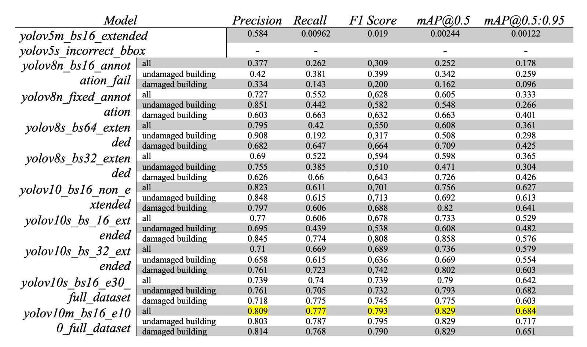

# RescueNet: Damaged Building Detection
> High Resolution UAV Semantic Segmentation for Natural Disaster Damage Assessment

## 📋 Project Overview
This project implements semantic segmentation for detecting damaged buildings in UAV imagery using the RescueNet dataset. The model helps in rapid damage assessment during natural disasters using drone footage.

## 🔍 Quick Links
- [Dataset on Kaggle](https://www.kaggle.com/datasets/yaroslavchyrko/rescuenet)
- [Live Demo on Hugging Face Spaces](https://huggingface.co/spaces/dolphinium/rescuenet-damaged-building-detection)
- [Experiment Results on CometML](https://www.comet.com/dolphinium/rescuenet-damaged-building-detection/view/new/panels)
- [Full Documentation (PDF)](https://github.com/dolphinium/rescuenet-damaged-building-detection/blob/main/documentation/documentation.pdf)

## 📊 Model Performance
Below is a comparison of different model architectures tested on the RescueNet dataset:

## 🛠️ Tools and Technologies Used

### Deep Learning & Computer Vision
* YOLOv5/v8/v10 - State-of-the-art object detection and segmentation models
* PyTorch - Deep learning framework
* OpenCV - Image processing and computer vision operations

### Model Development & Monitoring
* CometML - Experiment tracking, model monitoring, and performance visualization
* Weights & Biases - Model versioning and experiment tracking (alternative)

### Deployment & Hosting
* Hugging Face Spaces - Model hosting and deployment platform
* Gradio - Web interface development for machine learning models

### Geospatial Processing
* Folium - Interactive map visualization
* PyEXIFTool - Metadata extraction from drone imagery
* GDAL - Geospatial data processing (for coordinate transformations)

### Development Tools
* Python - Primary programming language
* Git - Version control
* Docker - Containerization (for deployment)

### Data Processing & Analysis
* NumPy - Numerical computing and array operations
* Pandas - Data manipulation and analysis
* Pillow (PIL) - Image processing
* Matplotlib - Data visualization

## ⚠️ Known Issues
1. **Metadata Extraction on HF Spaces**: 
   - Issue with extracting image metadata on the Hugging Face Spaces platform
   - Works correctly locally but fails on hosted environment
   - Currently using default parameter values as a workaround
   - [Related Discussion on HF Forums](https://discuss.huggingface.co/t/image-lost-xmp-data-on-uploads/100954)

## 📝 TODO List
- [ ] Fine-tune the model for improved performance
- [ ] Create comprehensive requirements.txt
- [ ] Enhance documentation
- [ ] Improve geolocation precision
- [ ] Clean up and migrate to new repository for hosting

## 🤝 Contributing
Contributions are welcome! Please feel free to submit a Pull Request.

## 📄 License
[Add License Information]

## 📬 Contact
[Add Contact Information]

